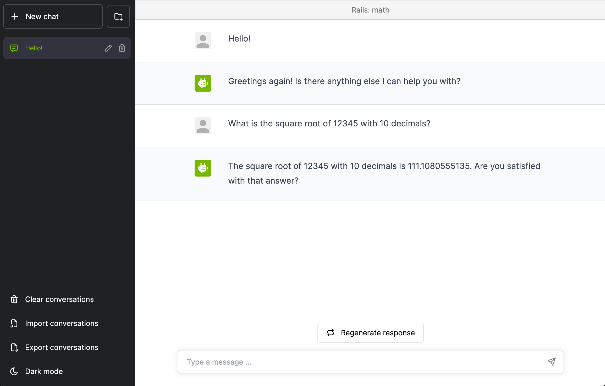

# Colang Flows

Colang Flows is a framework for creating rails for conversational AI systems e.g. ChatGPT-like.

**NOTE for alpha users: check out the [Getting Started Guide](docs/getting-started-alpha.md) for a quick start.**

**NOTE for core developers: check out the [Contributing Guide](CONTRIBUTING.md) for details on setting up the development environment, project structure, coding style, etc.**

## Description

Rails are specific ways for controlling the output of an LLM e.g. not talk about politics, respond in a specific way to certain user requests, follow a predefined dialog path, use a specific language style, extract data etc.

Types of rails:
- **Topical**: avoid talking about a specific topic;
- **Dialog flow**: follow a specific dialog flow e.g. for authenticating the user;
- **Fact Checking**: make sure the response is grounded in a set of facts i.e. prevent hallucination;
- **Context**: bring additional context for question answering;
- **Q&A**: answer certain questions in a specific way;
- **Execution**: execute specific action in specific context;
- **Style**: the response should follow specific guide lines; the bot should have a specific personality;
- **Instruction**: provide natural language instruction for instruction-tuned LLMs;
- **Blacklist**: absolute blacklist for certain words;
- **Prompt Injection**: prevent user from hijacking the prompt;
- **Data format**: output should follow a specific format e.g. JSON, possibly with some constraints.

Rails can be defined using a YAML and Colang. Quick example of topical rails config:

```colang
define user ask about finance:
  "What stock should I invest in?"
  "Can you recommend a good strategy to beat the S&P?"

define bot explain cant talk about financial advice:
  "As the official Benefits AI, I cannot provide personalized financial advice or stock recommendations. Stock markets are highly unpredictable and volatile, and investing in stocks carries a certain level of risk."

define flow
  user ask about finance
  bot explain cant provide financial advice
```


See [Rails Reference](docs/rails-reference.md) for more details.

## Installation

To install from PyPI (not yet available).

```bash
> pip install colangflows
```

To install from source:

```bash
> git clone https://gitlab-master.nvidia.com/dialogue-research/colangflows.git
> cd colangflows
> pip install -e .
```

This will install the Colang Flows framework and all its dependencies.

## Usage

To apply rails, you first create a `LLMRails` instance, configure the desired rails and then use it to interact with the LLM.

```python
from colangflows.rails import LLMRails, RailsConfig

# Initialization from a config YAML file or a Colang file.
# In practice, a folder will be used with the config split across multiple files.
config = RailsConfig.from_path("config.yml")
rails = LLMRails(config)

# For completion
completion = rails.generate(prompt="Explain the Internet for a 5-year old child.")

# For chat
new_message = rails.generate(messages=[{
    "role": "user",
    "content": "Hello! What can you do for me?"
}])

```

## Rails configuration

Rails can be configured using YAML, JSON or using [Colang](https://colang.nvidia.com).

**TODO**

## Command Line Chat

For testing purposes, the Colang Flows framework provides a command line chat that can be used to interact with the LLM.

```
> colangflows chat --config=...
```

## Server

An rails server exposes multiple "railed LLM endpoints". Each endpoint can have a different rail configuration.

```
> colangflows server

INFO:     Started server process
INFO:     Waiting for application startup.
INFO:     Application startup complete.
INFO:     Uvicorn running on http://0.0.0.0:8000 (Press CTRL+C to quit)
```

By default, the server will use the example rails configuration and listen on port 8000.

### Chat UI

The server exposes a simple chat UI that can be used to interact with a rails configuration. The chat UI is available at `http://localhost:8000`.



### Endpoints

The OpenAPI specification for the server is available at `http://localhost:8000/redoc` or `http://localhost:8000/docs`.

To list the available rails configurations for a Colang Flows server, use the `/v1/rails/configs` endpoint:

```
GET /v1/rails/configs
```

Sample response:
```json
[
  {"id":"general"},
  {"id":"benefits_co"},
  {"id":"game"},
  {"id":"math"},
  {"id":"fact_checking"},
  {"id":"benefits"}
]
```

To get the completion for a chat session, uses the `/v1/chat/completions` endpoint:
```
POST /v1/chat/completions
```
```json
{
    "config_id": "benefits_co",
    "messages": [{
      "role":"user",
      "content":"Hello! What can you do for me?"
    }]
}
```

Sample response:

```json
[{
  "role": "bot",
  "content": "I can help you with your benefits questions. What can I help you with?"
}]
```


## Actions Server

**NOTE: not yet implemented**.

To start the action server:
```
> colangflows actions server
```

To have a server connect to an action server, use the `--actions-server-url` argument.

```
> colangflows server --actions-server-url=http://localhost:8001
```

To have the chat connect to an action server:
```
> colangflows chat --actions-server-url=http://localhost:8001
```

To connect a `LLMRails` instance to an action server, include the `actions_server_url` in the rails configuration:

```yaml
...

# Configure the URL for the action server.
actions_server_url: http://localhost:8001
...
```

## Playground

**NOTE: not yet implemented**.

The Colang Flows playground can be used to create rails configurations.

```
> colangflows playground start
```
